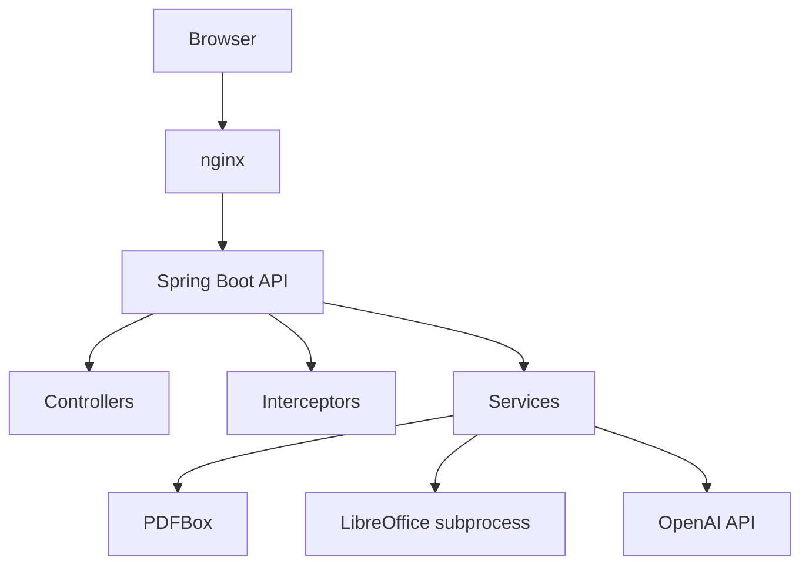
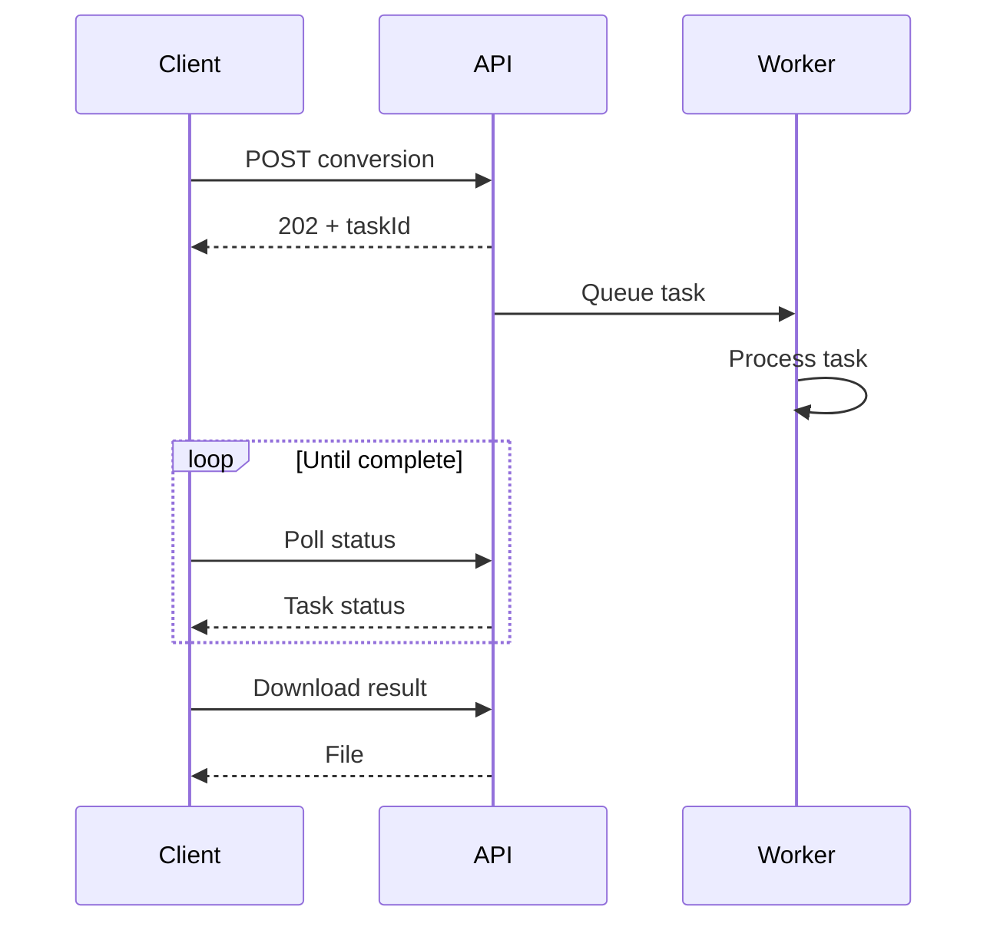

# DocConvert Pro – Multi-Format PDF & Document Conversion

A deployed Spring Boot application that converts between PDF and common office formats with asynchronous processing, configurable rate limiting, and optional AI summarization. Deploy locally or via Docker with automatic LibreOffice integration.

**🌐 Live Demo: [docconvertpro.duckdns.org](https://docconvertpro.duckdns.org)**

  
[](https://github.com/Doublespy8971/PdfConverterApplication/actions/workflows/deploy.yml)

**Deployed on:** Oracle Cloud Infrastructure (VM.Standard.A1.Flex, ARM, 6GB RAM) with nginx reverse proxy and Let's Encrypt SSL.

---

## Navigation

- [Features](#features)
- [Architecture](#architecture)
- [Getting Started](#getting-started)
- [API Reference](#api-reference)
- [Configuration](#configuration)
- [Load test results](#load-test-results)
- [Troubleshooting](#troubleshooting)
- [Known Limitations](#known-limitations)
- [Roadmap](#roadmap)

---

<a name="features"></a>
## Features

### 11+ Conversion Tools

| Tool | Input Formats | Output | Technical Notes |
|------|---------------|--------|-----------------|
| Word to PDF | DOC, DOCX, ODT, RTF, TXT | PDF | Requires LibreOffice |
| Excel to PDF | XLS, XLSX, ODS, CSV | PDF | Requires LibreOffice |
| PowerPoint to PDF | PPT, PPTX, ODP | PDF | Requires LibreOffice |
| Images to PDF | PNG, JPG, GIF, BMP, WebP | PDF | Pure Java; preserves aspect ratio |
| PDF to Images | PDF | ZIP (PNG pages) | Rasterizes at 150 DPI |
| PDF to Word | PDF | DOCX | Text extraction; layout not preserved |
| PDF to Excel | PDF | XLSX | Text-based; limited to 10 sheets |
| PDF to PowerPoint | PDF | PPTX | Text-based; limited to 20 slides |
| Split PDF | PDF | ZIP (individual pages) | One file per page |
| Merge PDF | Multiple PDFs | PDF | Concatenates in order |
| Compress PDF | PDF | PDF | Reduces image resolution to 75% quality |
| AI Summarizer (optional) | PDF | JSON summary | Uses OpenAI API; configurable length |

### Core Features

- **Asynchronous Processing**: HTTP 202 response on submission; clients poll for completion
- **Rate Limiting**: Token bucket algorithm; 15 requests/hour per IP by default (configurable)
- **Task Registry**: In-memory task storage with auto-expiration; 2-hour retention for results
- **Batch Operations**: Convert multiple files in one request; results packaged as ZIP
- **Responsive Web UI**: Modern single-page interface with progress bars and real-time feedback
- **RESTful API**: Complete API for programmatic use; all endpoints documented
- **Memory Optimized**: Uploads are written to temporary files; conversion results are held in memory (max 100 MiB each, 512 MiB total) until download or expiry
- **Security Hardened**: CORS origin validation, stateless API endpoints, file type validation, size limits

### Tech Stack

| Component | Technology |
|-----------|-----------|
| **Backend** | Java 21, Spring Boot 3.2.4 |
| **Frontend** | HTML5, CSS3, Vanilla JavaScript (no frameworks) |
| **PDF Processing** | Apache PDFBox 2.0.33 |
| **Office Conversion** | LibreOffice 7.x (subprocess) |
| **Rate Limiting** | Bucket4j 7.6.0 (token bucket) |
| **Caching** | Caffeine 3.1.8 |
| **AI Summarization** | OpenAI GPT-3.5 via OkHttp 4.11.0 |
| **Containerization** | Docker & Docker Compose |
| **Image Processing** | imgscalr 4.2 + Java ImageIO |
| **Office I/O** | Apache POI 5.2.5 |
| **Hosting** | Oracle Cloud Infrastructure (Always Free Tier) |
| **Web Server** | nginx with Let's Encrypt SSL |

---

<a name="architecture"></a>
## Architecture

### System Overview



### Request Lifecycle


- Uploads: `$JAVA_TMPDIR/convert_<taskId>/` and related temporary directories.
- Results: stored as byte arrays in the in-memory task registry; each result is capped at 100 MiB and all stored results at 512 MiB.
- Cleanup: temporary directories are scanned hourly and removed after 2 hours; completed or failed tasks are retained for 2 hours, while pending or processing tasks time out after 6 hours.
- Limits: the task registry accepts up to 1,000 tasks. When a task-count or stored-byte cap is reached, new requests receive `503 Service Unavailable`; an individual result that exceeds its cap or the remaining aggregate capacity marks that task failed.
- Processing: the async executor has 4 core threads, 8 maximum threads, and a queue capacity of 100. LibreOffice allows 2 concurrent conversions and each conversion times out after 120 seconds.
- Security and AI: the rate limit defaults to 15 requests per hour per IP but is configurable for conversion and AI initiation endpoints; status, download, metrics, and result endpoints are excluded. CSRF is ignored for `/api/**`, and CORS/security headers are configured separately. OpenAI is the working provider with a configurable model (default `gpt-3.5-turbo`); the Gemini provider is a placeholder and is not implemented.

---

<a name="getting-started"></a>
## Getting Started

### Prerequisites

**For Local Installation:**
- Java 21 or higher
- Maven 3.9+
- LibreOffice 7.x (for office conversions)
- 2GB RAM minimum
- 500MB free disk space

**For Docker:**
- Docker 20.10+
- Docker Compose 2.0+
- 1GB RAM, 1.5GB disk space

### Installation

#### Option 1: Local Development

```bash
# 1. Clone and navigate to project
cd PdfConverterApplication

# 2. Install LibreOffice
# macOS:
brew install --cask libreoffice
# macOS soffice is not on PATH; configure:
# app.libreoffice.command=/Applications/LibreOffice.app/Contents/MacOS/soffice
# Ubuntu/Debian:
sudo apt-get install libreoffice

# 3. Build
mvn clean package -DskipTests

# 4. Run
mvn spring-boot:run

# 5. Access at: http://localhost:8080
```

#### Option 2: Docker & Docker Compose

```bash
# Build and start (includes LibreOffice)
docker-compose up -d

# View logs
docker-compose logs -f pdf-converter

# Access at: http://localhost:8080
```

### Quick Test

```bash
# Submit conversion
curl -X POST \
  -F "file=@document.docx" \
  http://localhost:8080/api/convert/word-to-pdf

# Poll status
curl http://localhost:8080/api/convert/status/{taskId}

# Download result
curl -O http://localhost:8080/api/convert/download/{taskId}
```

---

<a name="api-reference"></a>
## API Reference

### Conversion Endpoints

#### POST `/api/convert/{tool}`

Convert a single file asynchronously. Returns HTTP 202 with taskId.

**Response (HTTP 202):**
```json
{
  "taskId": "550e8400-e29b-41d4-a716-446655440000",
  "status": "PENDING",
  "message": "Conversion processing initiated"
}
```

**Error Responses:**
- `400 Bad Request`: Empty file or unsupported extension
- `429 Too Many Requests`: Rate limit exceeded
- `413 Payload Too Large`: File exceeds 100MB

---

#### POST `/api/convert/batch/{tool}`

Convert multiple files. Results packaged as ZIP.

**Response (HTTP 202):**
```json
{
  "taskId": "550e8400-e29b-41d4-a716-446655440000",
  "status": "PENDING",
  "message": "Batch conversion processing initiated"
}
```

---

#### GET `/api/convert/status/{taskId}`

Poll task status.

**Response (HTTP 200):**
```json
{
  "taskId": "550e8400-e29b-41d4-a716-446655440000",
  "status": "PROCESSING",
  "fileName": "document.pdf",
  "contentType": "application/pdf",
  "createdAt": 1692374800000,
  "updatedAt": 1692374805000,
  "resultSize": 234567,
  "errorMessage": null
}
```

**Status values:** `PENDING`, `PROCESSING`, `COMPLETED`, `FAILED`

---

#### GET `/api/convert/download/{taskId}`

Download completed result. Task removed from registry after download.

**Response:**
- `200 OK`: File binary data
- `202 Accepted`: Still processing
- `400 Bad Request`: Conversion failed
- `404 Not Found`: Task not found or expired

---

#### GET `/api/convert/metrics`

Get task statistics.

**Response (HTTP 200):**
```json
{
  "totalTasks": 42,
  "pendingTasks": 2,
  "processingTasks": 1,
  "completedTasks": 35,
  "failedTasks": 4
}
```

---

#### POST `/api/ai/summarize`

Summarize a PDF using OpenAI (requires API key).

**Parameters:**
- `file` (form): PDF file
- `length` (form): `short`, `medium`, or `long`

---

<a name="configuration"></a>
## Configuration

### application.properties

```properties
# Server
server.port=8080

# File Upload Limits
spring.servlet.multipart.max-file-size=100MB
spring.servlet.multipart.max-request-size=500MB

# CORS
app.cors.allowed-origin=http://localhost:8080

# AI Summarization (optional)
ai.provider=openai
openai.api-key=sk-your-openai-key
openai.model=gpt-3.5-turbo

# Rate Limiting
app.rate-limit.trust-forwarded-headers=false
app.rate-limit.trusted-proxies=
app.rate-limit.requests-per-hour=15

# Async Processing
app.async.core-pool-size=4
app.async.max-pool-size=8
app.async.queue-capacity=100

# Task Cleanup
app.tasks.completed-retention-hours=2
app.tasks.processing-timeout-hours=6
app.tasks.cleanup-interval-ms=3600000
```

When nginx proxies requests to the application, enable forwarded headers only when the
application port is not publicly reachable, and list nginx's actual source IP:

```properties
app.rate-limit.trust-forwarded-headers=true
app.rate-limit.trusted-proxies=127.0.0.1
```

```nginx
proxy_set_header X-Real-IP $remote_addr;
proxy_set_header X-Forwarded-For $remote_addr;
```

CSRF is intentionally ignored for the stateless `/api/**` endpoints; CORS is configured separately.

### Environment Variables

```bash
JAVA_OPTS="-Xmx512m -Xms256m"
OPENAI_API_KEY=sk-your-key
APP_CORS_ALLOWED_ORIGIN=https://yourdomain.com
SERVER_PORT=8080
```

### Production Nginx Configuration

```nginx
server {
    listen 80;
    server_name yourdomain.com;

    location / {
        proxy_pass http://localhost:8080;
        proxy_set_header Host $host;
        proxy_set_header X-Real-IP $remote_addr;
        proxy_set_header X-Forwarded-For $remote_addr;
        proxy_set_header X-Forwarded-Proto $scheme;
        client_max_body_size 100m;
    }
}
```

Actuator listens on `127.0.0.1:8081` and exposes only health and Prometheus. A Prometheus
agent running on the server can scrape `http://127.0.0.1:8081/actuator/prometheus` directly.
If nginx must proxy metrics for a remote Prometheus, add an access-controlled internal location;
do not expose the management port publicly:

```nginx
location /internal/metrics {
    proxy_pass http://127.0.0.1:8081/actuator/prometheus;
    allow 10.0.0.0/8;
    deny all;
}
```

---

## Load test results

Environment: local Docker run, 2018 MacBook Pro 4-core i7 2.8 GHz and 16 GB, Docker Desktop
8 CPU / 8 GB, k6 on the same machine, JVM `-Xmx512m`, `app.libreoffice.permits=2`, LibreOffice
version: not recorded, rate limit raised via `docker-compose.loadtest.yml`, and fixtures of
946 B DOCX and 68 B PNG. This was a local run, not production. See
[loadtest/README.md](loadtest/README.md) for reproduction steps.

| VUs | Operation | p50 ms | p95 ms | p99 ms | max ms | Failures | Rate-limited |
|-----|-----------|--------|--------|--------|--------|----------|--------------|
| 1 | DOCX -> PDF | 3029 | 4067 | 5042 | 5415 | 0 | 0 |
| 1 | Images -> PDF | 1018 | 1023 | 1025 | 1026 | 0 | 0 |
| 2 | DOCX -> PDF | 3032 | 3053 | 3660 | 4254 | 0 | 0 |
| 2 | Images -> PDF | 1018 | 1025 | 1041 | 1046 | 0 | 0 |
| 8 | DOCX -> PDF | 7072 | 10086 | 12301 | 12307 | 0 | 0 |
| 8 | Images -> PDF | 3022 | 6042 | 6091 | 6103 | 0 | 0 |

| Operation | Result |
|-----------|--------|
| PDF -> Images | not measured |
| Merge PDF | not measured |
| Compress PDF | not measured |

Each run lasted 2 minutes and ran once; iterations were 29, 60, and 97 for 1, 2, and 8 VUs
respectively. Durations are quantized to whole seconds because the k6 script polls once per
second. Values are rounded to the nearest millisecond. During the 8-VU run, `docker stats`
showed about 208-221% CPU and 444-468 MiB memory. After the runs, only the java process was
running in the container; no leftover LibreOffice processes remained.

Throughput grew with concurrency up to the 2 LibreOffice permits, and latency rose at 8 VUs.

---

<a name="known-limitations"></a>
## Known Limitations

### Single-Instance Only
- Task state and completed results are stored in-memory and are lost on restart
- Configurable task-count, per-result, and aggregate-result limits return 503 when capacity is reached
- Not horizontally scalable without a shared task/result store

### LibreOffice Resource Constraints
- Office conversions require a locally installed LibreOffice executable
- Each conversion has an isolated temporary profile and a configurable process timeout
- Concurrent LibreOffice conversions default to two permits and are configurable

### PDF Conversion Quality
- Text extraction only; layout not preserved
- PDF → Word/Excel/PPT conversions have limited fidelity

### Memory Constraints
- Conversion results remain in memory until task retention cleanup or download
- Tune JVM heap and the task registry limits for the deployment workload

### File Size Limits
- Max 100MB per file and 500MB per batch request by default; both are configurable

---

<a name="roadmap"></a>
## Roadmap

### Next
- [ ] Redis task backend for horizontal scaling
- [ ] Enhanced error logging and monitoring
- [ ] API request authentication

### Later (unscheduled)
- [ ] RabbitMQ job queue for reliability
- [ ] S3 storage backend for results
- [ ] WebSocket real-time progress updates
- [ ] OCR support (Tesseract integration)
- [ ] Advanced PDF operations (form filling, digital signatures)

---

## Troubleshooting

### LibreOffice Not Found
```bash
brew install --cask libreoffice # macOS
sudo apt-get install libreoffice # Ubuntu
# Or use: docker-compose up -d
```

On macOS, `soffice` is not on `PATH`; set
`app.libreoffice.command=/Applications/LibreOffice.app/Contents/MacOS/soffice`.

### Port 8080 Already in Use
```bash
lsof -i :8080
kill -9 <PID>
```

### Out of Memory Error
```bash
export JAVA_OPTS="-Xmx2g -Xms1g"
mvn spring-boot:run
```

### Rate Limit Blocking Traffic
```properties
app.rate-limit.trust-forwarded-headers=true
app.rate-limit.trusted-proxies=192.0.2.10
```

`trusted-proxies` requires exact IP matches; CIDR ranges are not supported.

---

## Built With

[](https://spring.io/projects/spring-boot)
[](https://www.oracle.com/java/technologies/downloads/)
[](https://pdfbox.apache.org/)
[](https://www.libreoffice.org/)
[](https://www.docker.com/)
[](https://www.oracle.com/cloud/free/)
[](https://nginx.org/)
[](https://letsencrypt.org/)

---

## License

This project is licensed under the MIT License. See [LICENSE](LICENSE).

---

**Last Updated:** October 2026 | **Status:** Deployed | **Hosted:** Oracle Cloud Free Tier
